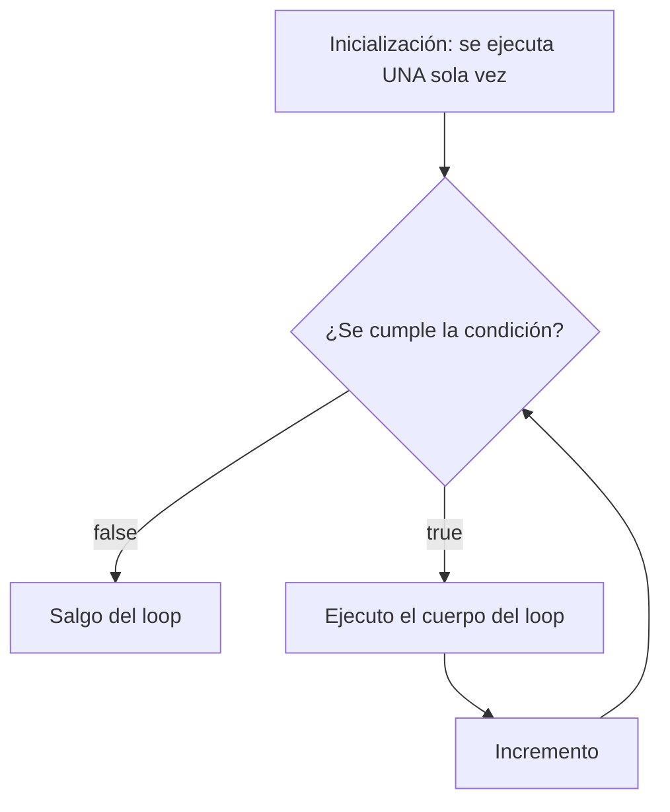
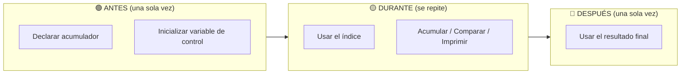
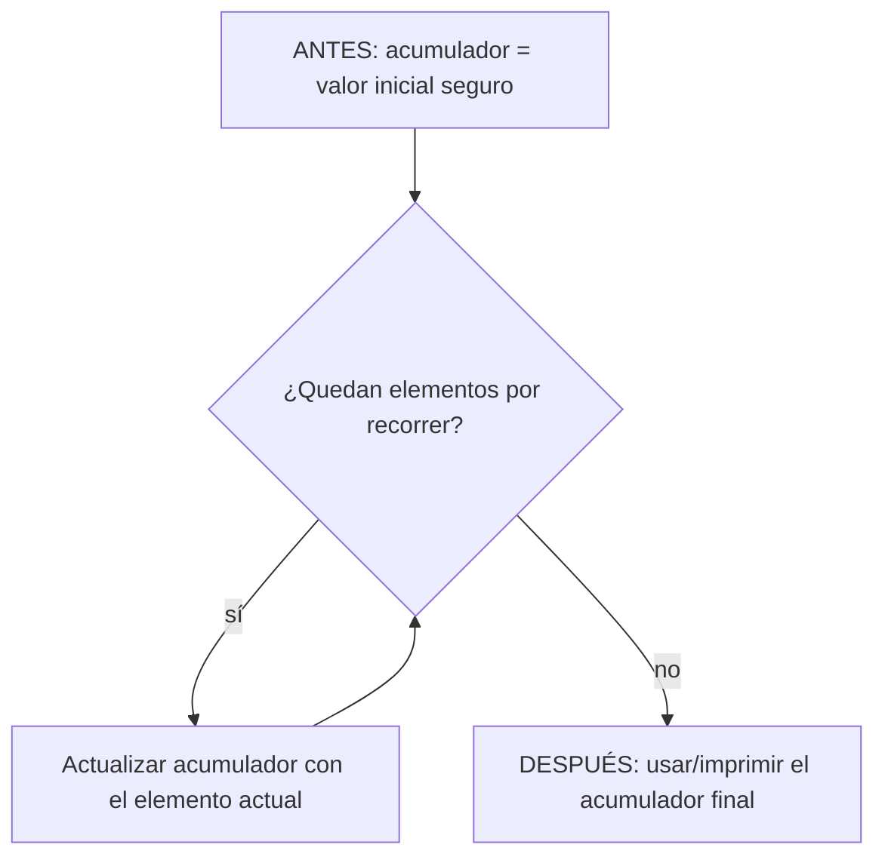
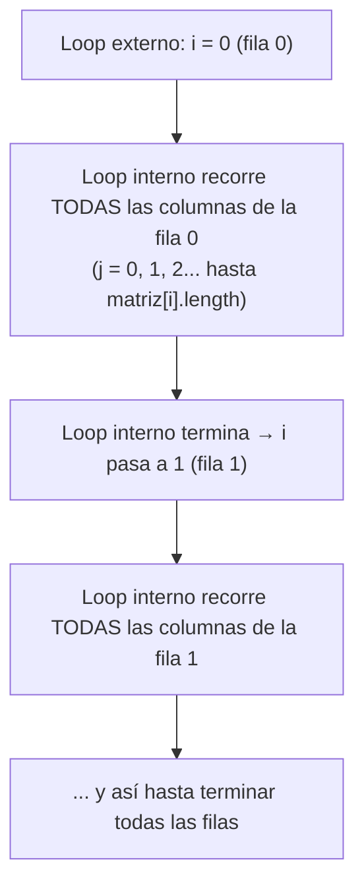
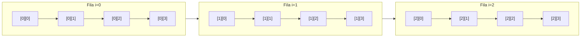
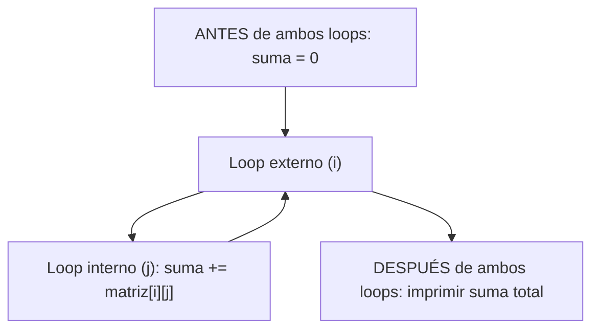
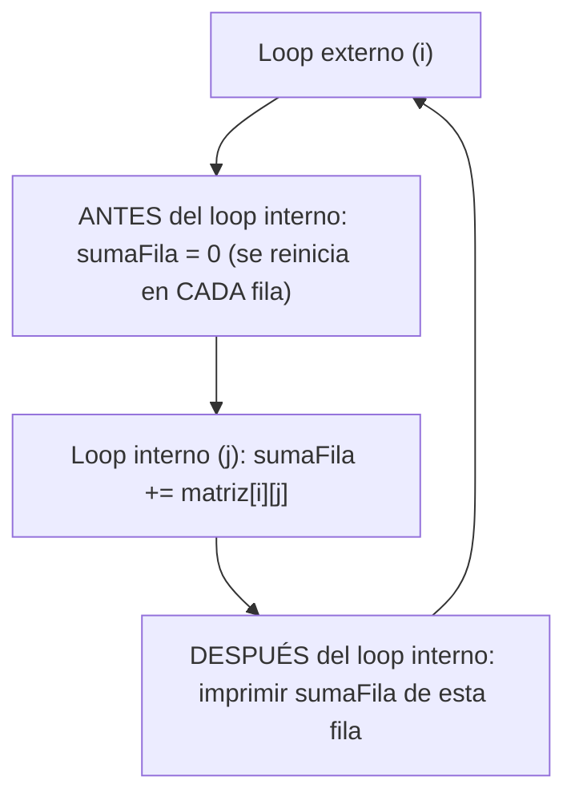

# <span style="color:#1565c0">Apuntes: Cómo pensar un bucle `for` (simple y anidado)</span>

> Relacionado: [[Arrayss_apuntes]] | [[Condicionales_apuntes]]
> Código de práctica: [[EjerciciosDeFor]] | [[EjerciciosComplejos]]

---

## <span style="color:#ef6c00">1. Anatomía de un `for` simple</span>

```java
for (inicialización; condición; incremento) {
    // cuerpo del loop
}
```

Cada parte responde una pregunta distinta. Antes de escribir un `for`, contestate esto en orden:

| Parte          | Pregunta que responde                                     |
| -------------- | --------------------------------------------------------- |
| Inicialización | ¿Desde qué valor arranco?                                 |
| Condición      | ¿Hasta cuándo sigo repitiendo? (mientras esto sea `true`) |
| Incremento     | ¿Cómo avanzo después de cada vuelta?                      |

### Diagrama de flujo — for simple



**Puntos clave de este diagrama:**
- La inicialización se ejecuta **una sola vez**, al principio. Nunca se repite.
- La condición se revisa **antes** de cada vuelta, incluida la primera.
- El incremento pasa **después** del cuerpo, no antes.
- Si la condición nunca se vuelve `false`, el loop es infinito.

---

## <span style="color:#ef6c00">2. Antes / Durante / Después — checklist mental</span>

Esto es lo que te tenés que preguntar siempre, en este orden, ANTES de escribir código:

### 🟢 ANTES del loop (fuera de las llaves)
- ¿Necesito una variable acumuladora (suma, contador, máximo)? Si sí, se declara **acá**, no dentro del loop.
- Si es un máximo/mínimo: ¿la inicialicé con un valor seguro? (el primer elemento del array, **no** un `0` fijo — repasá por qué en la sección de errores más abajo)

### 🟡 DURANTE el loop (dentro de las llaves)
- ¿Qué se repite exactamente en cada vuelta?
- ¿Estoy usando el índice del loop (`i`) para acceder a algo (`array[i]`)?
- ¿Hay una condición (`if`) que decide si hago algo en esa vuelta o no?

### 🔴 DESPUÉS del loop (fuera de las llaves, abajo)
- ¿Qué necesito hacer con el resultado acumulado? (imprimirlo, usarlo en otra cuenta, etc.)
- Ojo: una variable declarada **dentro** de las llaves del `for` no existe afuera (mismo concepto de *Scope* que ya viste en condicionales).



---

## <span style="color:#ef6c00">3. El patrón acumulador (suma, contador, máximo)</span>

Todos estos ejercicios comparten la misma estructura mental:



| Tipo de acumulador | Valor inicial correcto | Operación en cada vuelta |
|---|---|---|
| Suma | `0` | `suma += array[i]` |
| Contador | `0` | `contador++` (si se cumple una condición) |
| Máximo | **`array[0]`** (nunca `0` fijo) | `if (array[i] > max) max = array[i]` |
| Mínimo | **`array[0]`** (nunca `0` fijo) | `if (array[i] < min) min = array[i]` |

> ⚠️ **Por qué el máximo/mínimo NO se inicializa en `0`**: si todos los valores del array son negativos, un `0` inicial nunca se actualizaría y te quedarías con un resultado que ni siquiera pertenece al array. Usar `array[0]` es seguro siempre, porque es un valor que sí existe en los datos.

---

## <span style="color:#ef6c00">4. Bucle anidado — el mental model para matrices (arrays 2D)</span>

La idea clave: **el loop de afuera se mueve una sola posición cada vez que el loop de adentro termina completamente su recorrido.**



### Tabla de referencia — nunca te la olvides

| Necesito... | Uso... |
|---|---|
| Cantidad de filas | `matriz.length` |
| Cantidad de columnas de la fila `i` | `matriz[i].length` |
| Recorrer filas | loop externo, variable `i` |
| Recorrer columnas | loop interno, variable `j` (o `k`, nunca `l`) |
| Total de casilleros de la matriz | `matriz.length * matriz[0].length` |

### Diagrama visual de recorrido (matriz 3x4)



El orden real de recorrido es: `[0][0] → [0][1] → [0][2] → [0][3] → [1][0] → [1][1] → ...` — primero termina TODA una fila antes de saltar a la siguiente.

---

## <span style="color:#ef6c00">5. Dos patrones distintos de acumulador en 2D (no confundirlos)</span>

Esto es lo que más se presta a confusión, porque se parecen pero resuelven cosas distintas.

### Patrón A — Acumulador global (un solo resultado para toda la matriz)

*Ejemplo: promedio general de una matriz de temperaturas.*

### Patrón B — Acumulador por fila (un resultado distinto por cada fila)

*Ejemplo: total de ventas de cada vendedor por separado.*

> 🔑 **La diferencia clave está en DÓNDE vive la línea que reinicia el acumulador en `0`**: si va afuera de ambos loops → es un total general. Si va dentro del loop externo pero afuera del interno → se reinicia por cada fila.

---

## <span style="color:#ef6c00">6. Errores frecuentes — chuleta rápida</span>

| Error | Sintoma | Solución |
|---|---|---|
| **Off-by-one** | El loop imprime un elemento de más o de menos al principio/final | Preguntate: "¿cuál es el primer/último valor que necesito de verdad?" y ajustá inicialización/condición |
| **Inicializar máximo/mínimo en `0`** | Funciona con números positivos pero falla con negativos | Inicializar siempre con `array[0]` |
| **Usar el mismo índice para fila y columna** (`matriz[k][k]`) | Solo se recorre la diagonal, no toda la matriz | Usar una variable distinta por cada loop (`i` para fila, `j` para columna) |
| **Confundir `.length` de filas con `.length` de columnas** | `ArrayIndexOutOfBoundsException`, o se recorre mal una matriz no cuadrada | Loop externo → `matriz.length`. Loop interno → `matriz[i].length` |
| **No reiniciar el acumulador por fila cuando hace falta** | Los resultados de una fila "se arrastran" a la siguiente | Revisar bien en qué nivel del anidado se declara/reinicia la variable |
| **Usar `l` (ele) como variable de loop** | Confusión visual con el número `1` | Usar `i`, `j`, `k` para loops anidados |

---

## <span style="color:#2e7d32">Resumen rápido — antes de escribir cualquier `for`</span>

1. ¿Cuál es mi primer valor? → inicialización.
2. ¿Hasta cuándo repito? → condición (¿estoy seguro de qué `.length` usar?).
3. ¿Cómo avanzo? → incremento.
4. ¿Necesito acumular algo? → declarar ANTES del loop, con un valor inicial seguro.
5. Si es anidado: ¿el loop interno usa el `.length` correcto para SU dimensión (columnas de esa fila), no el del externo?
6. ¿Dónde necesito que viva cada variable — afuera de todo, entre los dos loops, o adentro del loop interno?
