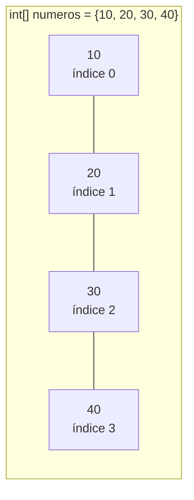
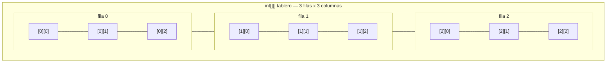

# <span style="color:#1565c0">📘 Apuntes: Arrays (Arreglos)</span>

> [!info] Relacionado
> Código de práctica: [[CODE - Arrayss]]
> Para el recorrido con `for`: [[Bucles_apuntes]] y [[Bucles_For_Diagrama_apuntes]]

---

## <span style="color:#ef6c00">1. ¿Qué es un Array?</span>

Un array es una estructura de datos que nos permite almacenar varios valores del mismo tipo en una sola variable. Funciona como una lista de elementos con un tamaño definido.



### Conceptos fundamentales:
- **Índices de base 0**: El primer elemento siempre está en la posición `0`.
- **Tamaño fijo**: Una vez creado, su tamaño no se puede cambiar.
- **Última posición**: Si el tamaño es `N`, la última posición válida es `N-1`.

---

## <span style="color:#ef6c00">2. Declaración y asignación</span>

```java
int[] num = new int[3];
num[0] = 1;
num[1] = 2;
num[2] = 3;

System.out.println(Arrays.toString(num));
```

- `int[]` define que la variable será un array de enteros.
- `new int[3]` reserva espacio para 3 elementos.
- Para imprimir el contenido se usa `Arrays.toString()`.

> [!warning] ¿Qué pasa si accedo a una posición que no existe?
> ```java
> int[] num = new int[3]; // posiciones válidas: 0, 1, 2
> num[3] = 5; // ❌ ArrayIndexOutOfBoundsException
> ```
> Es uno de los errores más comunes con arrays. Java revisa en tiempo de ejecución que el índice esté dentro del rango válido (`0` a `length-1`), y si te pasás, el programa se corta con esa excepción. Por eso, cuando recorrés un array con un `for`, la condición correcta es siempre `i < array.length` (nunca `<=`).

---

## <span style="color:#ef6c00">3. Array con contenido inicial</span>

```java
int[] listaNumeros = {1, 2, 3, 4, 4};
listaNumeros[2] = 5; // Cambia el valor en el índice 2
```

- Se usan llaves `{}` para inicializar con valores directamente.

---

## <span style="color:#ef6c00">4. Arrays de otros tipos y variables</span>

```java
String[] cadena = {"hola", "mundo", "java"};

int d1 = 2, d2 = 3, d3 = 4;
int[] TotalDatos = {d1, d2, d3};
```

- Puedes crear arrays de `String` o cualquier otro tipo.
- Puedes usar variables para llenar el contenido del array.

---

## <span style="color:#ef6c00">5. Búsqueda por índice</span>

```java
int[] busqueda = {1, 3, 3, 4, 5};
System.out.println(busqueda[2]); // Devuelve el valor en la posición 2
```

---

## <span style="color:#ef6c00">6. Arrays Multidimensionales</span>

Son arrays dentro de otros arrays, funcionando como tablas (filas y columnas).

```java
int[][] multiples = new int[1][2];
multiples[0][0] = 1;
multiples[0][1] = 2;

System.out.println(Arrays.deepToString(multiples));
```

### Inicialización directa (3x3):
```java
int[][] tablero = {
    {1, 2, 3},
    {1, 2, 3},
    {1, 2, 3}
};
```



- Para imprimir arrays multidimensionales se usa `Arrays.deepToString()`.
- `tablero.length` → cantidad de filas.
- `tablero[i].length` → cantidad de columnas de la fila `i` (útil porque no todas las filas tienen por qué medir lo mismo, aunque en este ejemplo sí).

> [!tip] Ver también
> El recorrido de matrices con `for` anidado (cuál índice va con cuál dimensión) está desarrollado en detalle en [[Bucles_For_Diagrama_apuntes]].

---

## <span style="color:#c62828">⚠️ Errores comunes</span>

> [!danger] `ArrayIndexOutOfBoundsException`
> Acceder a `array[array.length]` o cualquier índice negativo. El rango válido siempre es `0` a `length - 1`.

> [!danger] Confundir `.length` (array) con `.length()` (String)
> Los arrays usan `.length` **sin paréntesis** (es un atributo, no un método). Los `String` usan `.length()` **con paréntesis** (es un método). Mezclarlos da error de compilación.

> [!danger] Pensar que el array cambia de tamaño
> ```java
> int[] num = new int[3];
> num[3] = 4; // ❌ No "agranda" el array, tira excepción
> ```
> Si necesitás una lista de tamaño variable, más adelante vas a ver estructuras como `ArrayList`, que sí permiten crecer.

---

## <span style="color:#2e7d32">✅ Resumen rápido</span>

- `[]`: Símbolo para declarar arrays.
- `index 0`: Punto de partida.
- `.length`: Tamaño del array (sin paréntesis).
- `Arrays.toString()`: Para ver arrays simples.
- `Arrays.deepToString()`: Para ver arrays de varias dimensiones.
- Rango válido de índices: `0` a `length - 1`, siempre.
