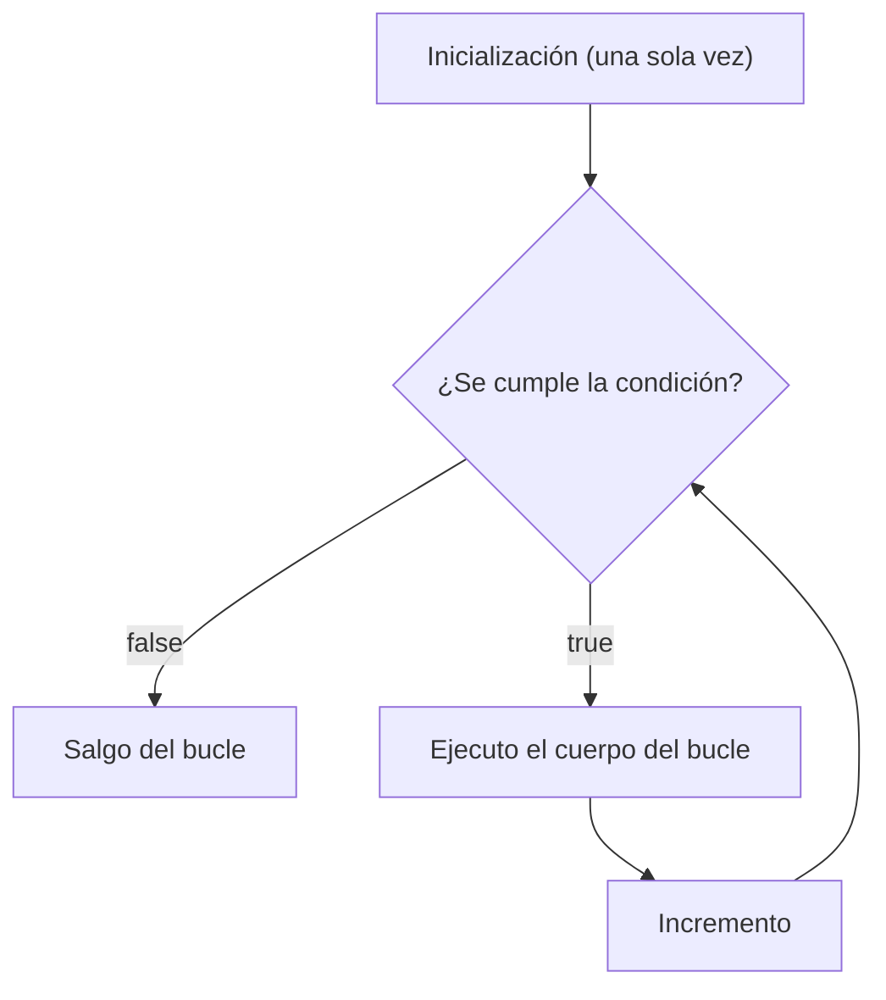

# <span style="color:#1565c0">📘 Apuntes: Bucles (el `for`)</span>

> [!info] Relacionado
> Código de práctica: [[CODE - Bucles]] | [[EjerciciosDeFor]] | [[EjerciciosComplejos]] | [[RefuezosDeEjerciciosComplejos]]
> Diagrama visual detallado: [[Bucles_For_Diagrama_apuntes]]

---

## <span style="color:#ef6c00">1. ¿Qué es un bucle?</span>

Un bucle es una estructura de control que permite **repetir un bloque de código varias veces** sin tener que escribirlo una y otra vez. Se repite mientras se cumpla una condición determinada.

> [!tip] ¿Por qué existen los bucles?
> Repasá el ejercicio del tablero 3x3: llenarlo "a mano" te llevaba 9 líneas de código repetitivo. Un bucle te permite expresar esa misma idea en 3 líneas, sin importar si el tablero tiene 9 casillas o 9000.

---

## <span style="color:#ef6c00">2. Anatomía del `for`</span>

```java
for (inicialización; condición; incremento) {
    // cuerpo del bucle
}
```

| Parte | Pregunta que responde |
|---|---|
| Inicialización | ¿Desde qué valor arranco? (se ejecuta **una sola vez**) |
| Condición | ¿Hasta cuándo sigo repitiendo? (se revisa **antes** de cada vuelta) |
| Incremento | ¿Cómo avanzo después de cada vuelta? |



---

## <span style="color:#ef6c00">3. Antes de usarlo (Requisitos)</span>

Para usar un `for` con confianza, conviene dominar antes:
- **Arrays** (ver [[Arrayss_apuntes]]): la mayoría de los bucles recorren o llenan arrays.
- **Operadores relacionales** (`<`, `<=`, `>`, etc.): definen la condición de corte.
- **Condicionales** (ver [[Condicionales_apuntes]]): es común combinar un `if` dentro de un `for`.

---

## <span style="color:#ef6c00">4. Al momento de usarlo (Buenas prácticas)</span>

- **El acumulador vive afuera**: si necesitás sumar, contar o buscar un máximo, esa variable se declara **antes** del `for`, nunca dentro (si no, se reinicia en cada vuelta).
- **`i`, `j`, `k` para nombrar índices**: evitá `l` (ele) porque se confunde visualmente con el número `1`.
- **Usá `.length` del array en la condición**, en vez de un número fijo (`i < array.length`, no `i < 6`). Así el código sigue funcionando aunque cambie el tamaño del array.
- **Al inicializar un máximo o mínimo**, arrancá con el primer elemento del array (`array[0]`), nunca con `0` a secas — si todos los valores fueran negativos, un `0` inicial daría un resultado incorrecto.

---

## <span style="color:#ef6c00">5. Después de usarlo (Consideraciones)</span>

- **Scope**: la variable del `for` (`i`, por ejemplo) solo existe dentro de las llaves del bucle, igual que con los `if` — no podés usarla después de que el bucle termina.
- **Bucles anidados (`for` dentro de otro `for`)**: se usan para recorrer arrays multidimensionales. El bucle externo recorre las filas, y por cada fila, el bucle interno recorre todas sus columnas antes de que el externo avance a la fila siguiente. El desarrollo completo de este tema, con diagramas de recorrido paso a paso, está en [[Bucles_For_Diagrama_apuntes]].

---

## <span style="color:#ef6c00">Ejemplo rápido</span>

```java
int[] lista = new int[3];

for (int i = 0; i < lista.length; i++) {
    lista[i] = i;
    System.out.println("en la posicion " + i + " se guardo " + lista[i]);
}
```

---

## <span style="color:#c62828">⚠️ Errores comunes</span>

> [!danger] Off-by-one (empezar o terminar un valor de más/de menos)
> ```java
> for (int i = 0; i <= 10; i++) { } // recorre 11 veces (0 a 10), no 10
> ```
> Antes de escribir la condición, preguntate: "¿cuál es el último valor que necesito de verdad?"

> [!danger] Inicializar un máximo/mínimo en `0`
> Funciona con números positivos, pero falla si todos los valores del array son negativos. Usá siempre `array[0]` como punto de partida seguro.

> [!danger] Usar el mismo índice para fila y columna en una matriz
> ```java
> matriz[k][k] // ❌ Solo recorre la diagonal, no toda la matriz
> matriz[i][j] // ✅ Cada dimensión con su propio índice
> ```

> [!danger] Condición que nunca se vuelve `false`
> ```java
> for (int i = 0; i > -1; i++) { } // ❌ i siempre es mayor a -1: bucle infinito
> ```

---

## <span style="color:#2e7d32">✅ Resumen rápido</span>

- `for`: repetir código un número determinado de veces.
- 3 partes clave: inicialización (una vez), condición (se revisa siempre antes de cada vuelta), incremento.
- Acumuladores (suma, contador, máximo) se declaran **antes** del bucle.
- `for` anidado: el externo recorre filas, el interno recorre columnas de esa fila.
- Chuleta visual completa de todo esto: [[Bucles_For_Diagrama_apuntes]].
