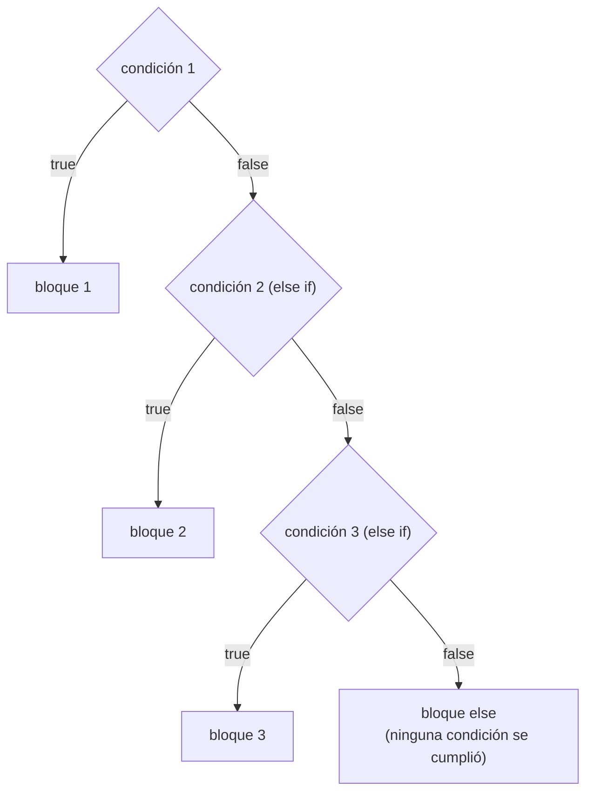

# <span style="color:#1565c0">📘 Apuntes: Condicionales (if, else if, else)</span>

> [!info] Relacionado
> Código de práctica: [[CODE - Condicionales]]

---

## <span style="color:#ef6c00">1. ¿Qué son las condicionales?</span>

Las condicionales son estructuras de control que permiten que un programa tome decisiones. Ejecutan bloques de código específicos basándose en si una condición es verdadera (`true`) o falsa (`false`).

---

## <span style="color:#ef6c00">2. ¿Cómo funcionan?</span>

El flujo del programa llega a la instrucción `if`. Se evalúa la expresión booleana dentro del paréntesis:
- Si es **true**, se ejecuta el bloque de código entre llaves `{}`.
- Si es **false**, el programa salta ese bloque y continúa con el siguiente (o entra en un `else` si existe).

```java
if (condicion) {
    // Código si es verdadero
} else {
    // Código si es falso
}
```

### Diagrama de decisión (if / else if / else)



> [!tip] El programa se detiene en la primera que sea verdadera
> En una cadena `if / else if / else if / else`, apenas una condición da `true`, Java ejecuta ese bloque y **se salta todo el resto**, sin revisar las condiciones que faltaban. Por eso el orden importa: las condiciones más específicas van primero.

---

## <span style="color:#ef6c00">3. Antes de usarlas (Requisitos)</span>

Para usar condicionales correctamente, debes dominar:
- **Expresiones Booleanas**: La condición SIEMPRE debe devolver un `boolean` (`true` o `false`).
- **Operadores Relacionales**: `==` (igual), `!=` (distinto), `>` (mayor), `<` (menor), `>=` (mayor o igual), `<=` (menor o igual).
- **Operadores Lógicos**: `&&` (AND), `||` (OR), `!` (NOT). Ver [[OperadoresLogicos_apuntes]].

---

## <span style="color:#ef6c00">4. Al momento de usarlas (Buenas prácticas)</span>

- **Uso de llaves**: Aunque para una sola línea no son obligatorias, se recomienda usarlas siempre `{}` para evitar errores lógicos al añadir más código después.
- **Identación**: Mantén el código dentro de las llaves alineado para facilitar la lectura.
- **Orden lógico**: En estructuras `if - else if`, el programa se detiene en la primera condición que sea verdadera. Pon las condiciones más específicas al principio.

---

## <span style="color:#ef6c00">5. Después de usarlas (Consideraciones)</span>

- **Ámbito o Scope**: Ten en cuenta que cualquier variable declarada dentro de las llaves `{}` de un `if` o `else` **solo existe allí dentro**. No podrás usarla fuera del bloque condicional.
- **Flujo del programa**: Asegúrate de que el estado de tus variables después de la condicional sea el esperado, especialmente si la condicional no se llegó a ejecutar.

> [!danger] Ejemplo real del error de scope
> ```java
> if (5 > 3) {
>     String mensaje = "Es mayor";
> }
> System.out.println(mensaje); // ❌ Error: cannot find symbol 'mensaje'
> ```
> `mensaje` "nace" y "muere" dentro de las llaves del `if`. Para usarla afuera, hay que declararla **antes** del `if`:
> ```java
> String mensaje = "";
> if (5 > 3) {
>     mensaje = "Es mayor"; // acá solo se le asigna un valor, no se vuelve a declarar
> }
> System.out.println(mensaje); // ✅ funciona
> ```

---

## <span style="color:#2e7d32">Ejemplo rápido</span>

```java
int numero = 4;
if (5 > numero) {
    System.out.println("5 es mayor a: " + numero);
}
```

---

## <span style="color:#c62828">⚠️ Errores comunes</span>

> [!danger] Usar `=` en vez de `==`
> ```java
> if (numero = 5) { } // ❌ Error de compilación (= es asignación, no comparación)
> if (numero == 5) { } // ✅ correcto
> ```

> [!danger] Usar una variable fuera de su scope
> Ver el ejemplo detallado más arriba, en la sección de Scope.

> [!danger] Olvidar que el orden de los `else if` importa
> Si ponés una condición general antes que una específica, la específica nunca se va a evaluar porque el programa ya se detuvo en la general.

---

## <span style="color:#2e7d32">Resumen rápido</span>

- `if`: "Si se cumple esto..."
- `else`: "Si no se cumplió lo anterior..."
- `boolean`: El corazón de toda condición.
- `Scope`: Lo que pasa en el `if`, se queda en el `if` (si declaras variables allí).
