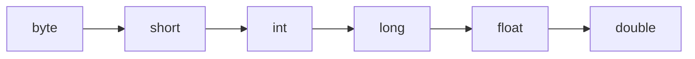

# <span style="color:#1565c0">📘 Apuntes: Conversión de Datos (Casting)</span>

> [!info] Relacionado
> Código de práctica: [[CODE - ConversionDeDatos]]

---

## <span style="color:#ef6c00">1. De Número a String</span>

Existen varias formas de convertir un valor numérico a texto:

1. **String.valueOf()**: `String.valueOf(num)`
2. **Integer.toString()**: `Integer.toString(num)`
3. **Concatenación**: `num + ""` (la forma más rápida)

---

## <span style="color:#ef6c00">2. De String a Número</span>

Para convertir texto (que contiene números) a un tipo numérico real:

- **A Entero**: `Integer.parseInt("123")`
- **A Double**: `Double.parseDouble("3.14")`

> [!warning] Esto puede fallar
> Si el `String` no contiene un número válido (por ejemplo `Integer.parseInt("hola")`), Java tira un error en tiempo de ejecución llamado `NumberFormatException`. Esto es muy común cuando se procesa lo que escribe un usuario con `Scanner`, porque no hay garantía de que haya tipeado un número.

---

## <span style="color:#ef6c00">3. Entre tipos numéricos (Casting)</span>

Java distingue dos formas de convertir entre tipos numéricos, según si se puede perder información o no:



- **Ir hacia la derecha** (de un tipo "chico" a uno "grande", como `int` → `double`): conversión **implícita**, Java lo hace solo, sin riesgo de perder datos.
- **Ir hacia la izquierda** (de un tipo "grande" a uno "chico", como `double` → `int`): conversión **explícita**, hay que pedirla a mano con `(tipo)`, porque se puede perder información.

### De Double a Entero (Casting explícito)
Se pierde la parte decimal — y **no redondea**, directamente la descarta (trunca).
```java
double num1 = 12.99;
int entero = (int) num1; // Resultado: 12, no 13
```

> [!warning] `(int)` trunca, no redondea
> Un error muy común es pensar que `(int) 12.99` da `13`. En realidad Java simplemente **corta** la parte decimal sin mirar si redondearía para arriba o para abajo. Si necesitás redondeo real, existe `Math.round()`, que vas a ver más adelante.

### De Entero a Double (Casting implícito)
Se hace automáticamente porque no hay riesgo de perder información.
```java
int entero2 = 12;
double double1 = entero2; // Resultado: 12.0
```

---

## <span style="color:#ef6c00">4. ¿Por qué existen ambas formas?</span>

Java es un lenguaje que prioriza la seguridad de tipos: te deja hacer sin pedir permiso las conversiones que **nunca** pierden información (`int` → `double`), pero te obliga a escribir explícitamente `(tipo)` cuando la conversión **podría** perder datos (`double` → `int`). Es una forma de que el compilador te avise "ojo, acá podés estar perdiendo información" y vos confirmes que lo hacés a propósito.

---

## <span style="color:#c62828">⚠️ Errores comunes</span>

> [!danger] Olvidarse el casting explícito
> ```java
> double promedio = 8.5;
> int redondeado = promedio; // ❌ Error: incompatible types, possible lossy conversion
> ```
> Hay que escribir `int redondeado = (int) promedio;` a propósito.

> [!danger] Confundir truncar con redondear
> ```java
> double nota = 6.9;
> int notaFinal = (int) nota; // da 6, no 7 — ¡ojo si esperabas que redondeara!
> ```

---

## <span style="color:#2e7d32">✅ Resumen rápido</span>

- `String.valueOf()`: Número → Texto.
- `Integer.parseInt()`: Texto → Entero (puede fallar con `NumberFormatException`).
- `(int)`: Double → Entero, truncando decimales (no redondea).
- Chico → grande: implícito y seguro. Grande → chico: explícito, con riesgo de perder datos.
