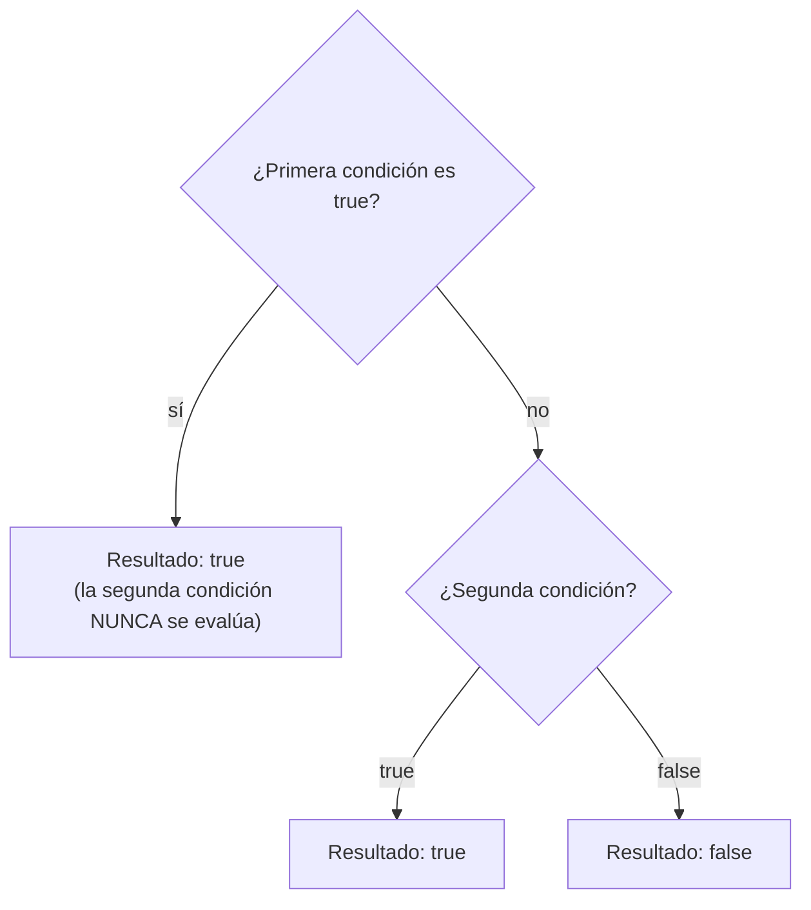
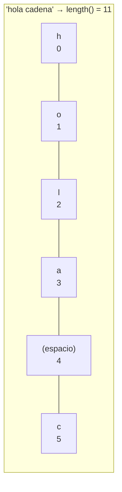

# <span style="color:#1565c0">📘 Apuntes: Operadores Lógicos y Strings</span>

> [!info] Relacionado
> Código de práctica: [[CODE - OperadoresLogicos]]

---

## <span style="color:#ef6c00">1. Operador Y (AND) - `&&`</span>

Compara dos condiciones y devuelve `true` solo si **ambas** son verdaderas.

| A     | B     | A && B |
| ----- | ----- | ------ |
| false | false | false  |
| false | true  | false  |
| true  | false | false  |
| true  | true  | true   |

### ¿Por qué se llama "cortocircuito"?
Java es "vago" a propósito: si la primera condición de un `&&` ya es `false`, ni se molesta en evaluar la segunda, porque el resultado ya está decidido (no importa qué sea B, el total va a ser `false`).


> [!tip] ¿Para qué sirve esto en la práctica?
> Podés escribir código seguro como `if (lista != null && lista.length > 0)`. Si `lista` fuera `null`, la primera condición ya da `false` y Java ni intenta evaluar `lista.length` — evitando un error de tipo `NullPointerException` que ocurriría si mirara la segunda parte.

---

## <span style="color:#ef6c00">2. Operador O (OR) - `||`</span>

Devuelve `true` si al menos **una** de las condiciones es verdadera.

| A | B | A \|\| B |
|---|---|---|
| false | false | false |
| false | true | true |
| true | false | true |
| true | true | true |



---

## <span style="color:#ef6c00">3. Operador NO (NOT) - `!`</span>

Invierte el valor lógico (negación).

- `!true = false`
- `!false = true`

---

## <span style="color:#ef6c00">4. Manipulación de Strings</span>

### Obtener longitud
Usa `.length()` para saber cuántos caracteres tiene una cadena.
```java
String name = "paco";
System.out.println(name.length()); // 4
```

### Obtener carácter específico
Usa `.charAt(índice)`. Recuerda que los índices empiezan en 0.
```java
var cadena = "hola cadena";
System.out.println(cadena.charAt(3)); // 'a'
```



> [!warning] El último carácter está en `length() - 1`, no en `length()`
> ```java
> String cadena = "hola";
> cadena.charAt(4); // ❌ StringIndexOutOfBoundsException
> cadena.charAt(3); // ✅ 'a' — el último índice válido es length()-1
> ```
> Esto pasa porque los índices arrancan en `0`: una cadena de 4 caracteres ocupa las posiciones `0, 1, 2, 3`, nunca la `4`.

---

## <span style="color:#c62828">⚠️ Errores comunes</span>

> [!danger] Usar un solo `&` o `|` en vez de `&&` o `||`
> `&` y `|` también existen en Java, pero **no** hacen cortocircuito: evalúan siempre ambos lados, incluso cuando no hace falta. Para lógica de condiciones, casi siempre vas a querer `&&` y `||`.

> [!danger] Acceder a un índice fuera de rango en un String
> Ya visto arriba: `charAt(longitud)` siempre falla, el máximo válido es `longitud - 1`.

---

## <span style="color:#2e7d32">✅ Resumen rápido</span>

- `&&`: Todo debe ser cierto (cortocircuito: para en el primer `false`).
- `||`: Al menos uno cierto (cortocircuito: para en el primer `true`).
- `!`: Lo contrario.
- `.length()`: Tamaño del texto.
- `.charAt()`: Letra en una posición (0 a `length()-1`).
