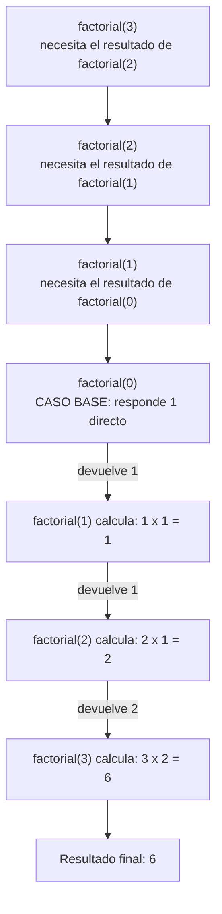

# Apuntes: Recursividad

> Código limpio: [[CODE - Recursividad]]

## 1. ¿Qué es la recursividad?

Es cuando un método **se llama a sí mismo** para resolver un problema, pero cada vez con un valor **más chico**, hasta que llega a un caso tan simple que puede responder directo, sin llamar a nadie más.

## 2. Explicación sencilla

> [!tip] Para cualquier persona que recién arranca
> Un método recursivo tiene dos partes:
> - **Caso base**: la condición más simple, donde el método responde directo sin llamarse de nuevo. Sin esto, el método nunca pararía.
> - **Paso recursivo**: el método se llama a sí mismo con un valor más chico, y **usa el resultado que le devuelve esa llamada para armar su propio resultado**.
>
> Ese es el punto clave: **el resultado de la llamada de adentro se usa para calcular el resultado nuevo**, uno arriba del otro, hasta llegar al final.

## 3. Mi propia explicación (la que mejor entendí)

> [!note] En mis palabras
> Primero se va restando 1 (o achicando el problema) hasta llegar al caso base (por ejemplo, hasta que `n` llegue a `0`).
> Una vez que llega ahí, empieza a resolverse **de atrás para adelante**:
> - `factorial(0)` devuelve `1` (caso base).
> - `factorial(1)` = `1 * factorial(0)` = `1 * 1` = `1`.
> - `factorial(2)` = `2 * factorial(1)` = `2 * 1` = `2`.
> - `factorial(3)` = `3 * factorial(2)` = `3 * 2` = `6`.
>
> Y así sigue subiendo hasta llegar a `n`. **El resultado de cada paso se usa para calcular el resultado del paso siguiente**, no se pierde en ningún lado.

## 4. ¿Dónde se guarda el resultado si no hay una variable mía?

Java arma una especie de **pila de hojas** (una por cada llamada). Cuando un método llama a otro, la hoja de arriba **se pausa** justo en esa línea, esperando la respuesta. Cuando la llamada de adentro responde, ese valor **entra directo** en el lugar exacto donde estaba esperando — no hace falta que vos guardes nada en una variable propia para que esto funcione.

## 5. Diagrama paso a paso (factorial de 3)

> [!warning] Lo que hay que mirar en el diagrama
> - Las flechas de arriba (A → B → C → D) son la **bajada**: cada método le pasa el problema al siguiente, más chico.
> - Las flechas de abajo (D → E → F → G) son la **subida**: cada resultado se usa para calcular el resultado nuevo de arriba.
> - El caso base (`D`) es el único que no espera a nadie: responde directo.

## Resumen rápido

- **Caso base**: para la recursividad, responde directo.
- **Paso recursivo**: se llama a sí mismo con algo más chico, y usa esa respuesta para armar el resultado nuevo.
- El "guardado" del resultado lo hace Java solo, con la pila de llamadas — no hace falta una variable propia para que viaje de un paso a otro.
- Primero se baja hasta el caso base, después se sube resolviendo paso a paso.
