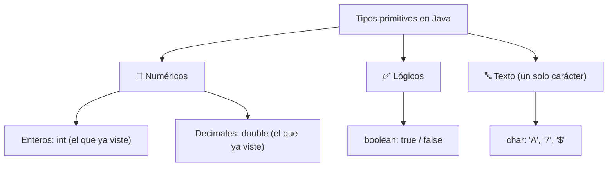

# <span style="color:#1565c0">📘 Apuntes: Tipos de Datos Primitivos</span>

> [!info] Relacionado
> Código de práctica: [[CODE - Tipos De Datos Primitivos]]

---

## <span style="color:#ef6c00">1. ¿Qué son los tipos de datos primitivos?</span>

Los tipos primitivos son los datos básicos que usa Java para almacenar valores simples. Son fundamentales porque **cada variable debe tener un tipo definido**, y ese tipo determina cuánto espacio en memoria ocupa y qué operaciones podés hacer con ella.



> [!note] Existen más tipos numéricos
> Además de `int` y `double`, Java tiene `byte`, `short`, `long` (enteros de distinto tamaño) y `float` (decimal de menor precisión que `double`). Todavía no los viste en profundidad, pero vale saber que existen para cuando necesites números muy grandes o quieras ahorrar memoria.

---

## <span style="color:#ef6c00">2. Ejercicio 1: tipo entero</span>

```java
int entero = 10;
System.out.println("Valor de la variable entero es : " + entero);
```

- `int` sirve para guardar números enteros.
- En este ejemplo, la variable `entero` guarda el valor `10`.

> [!warning] ¿Por qué importa el rango de `int`?
> `int` no puede guardar cualquier número: su rango va de **-2.147.483.648 a 2.147.483.647**. Si te pasás de ese límite (por ejemplo sumando dos números muy grandes), ocurre un **overflow**: el valor "da la vuelta" y aparece un número negativo inesperado, sin que Java tire ningún error. Es uno de los bugs más difíciles de detectar porque el programa sigue corriendo normalmente, solo que con un resultado incorrecto.

---

## <span style="color:#ef6c00">3. Ejercicio 2: tipo decimal</span>

```java
double decimal = 3.14;
System.out.println("Valor de la variable decimal es : " + decimal);
```

- `double` permite guardar números con decimales.
- Aquí el valor `3.14` se imprime en pantalla.

> [!tip] Buena práctica
> Usa `double` para valores con punto decimal. Recuerda escribir el decimal con punto, no con coma.

---

## <span style="color:#ef6c00">4. Ejercicio 3: tipo booleano</span>

```java
boolean esVerdadero = true;
System.out.println("Valor de la variable esVerdadero es : " + esVerdadero);
```

- `boolean` solo puede tener dos valores: `true` o `false`.
- Se usa mucho en condiciones y decisiones del programa (ver [[Condicionales_apuntes]]).

---

## <span style="color:#ef6c00">5. Ejercicio 4: tipo carácter</span>

```java
char caracter = 'A';
System.out.println("Valor de la variable caracter es : " + caracter);
```

- `char` guarda un solo carácter.
- Se escribe entre comillas simples `'A'`.

> [!warning] `char` no es lo mismo que `String`
> `char caracter = 'A';` usa comillas **simples** y guarda un único carácter. `String texto = "A";` usa comillas **dobles** y guarda una cadena (aunque tenga un solo carácter adentro). Son tipos completamente distintos: si intentás mezclarlos con el tipo de comilla equivocado, Java tira error de compilación.

---

## <span style="color:#c62828">⚠️ Rangos de los tipos numéricos (tabla de referencia)</span>

| Tipo | Tamaño | Rango aproximado |
|---|---|---|
| `int` | 32 bits | -2.147.483.648 a 2.147.483.647 |
| `double` | 64 bits | ±4.9 × 10⁻³²⁴ hasta ±1.7 × 10³⁰⁸ (con decimales) |
| `char` | 16 bits | un carácter Unicode (letras, números, símbolos) |
| `boolean` | 1 bit (conceptual) | solo `true` o `false` |

> [!question] ¿Cuándo importa esto en la práctica?
> Casi nunca vas a tocar estos límites en ejercicios chicos, pero es clave entenderlos para el día que trabajes con cálculos grandes (por ejemplo, factoriales de números altos) — ahí un `int` se queda corto y hace falta `long` o incluso otros tipos más avanzados.

---

## <span style="color:#2e7d32">✅ Resumen rápido</span>

- `int`: números enteros.
- `double`: números con decimales.
- `boolean`: verdadero o falso.
- `char`: un solo carácter (comillas simples).
