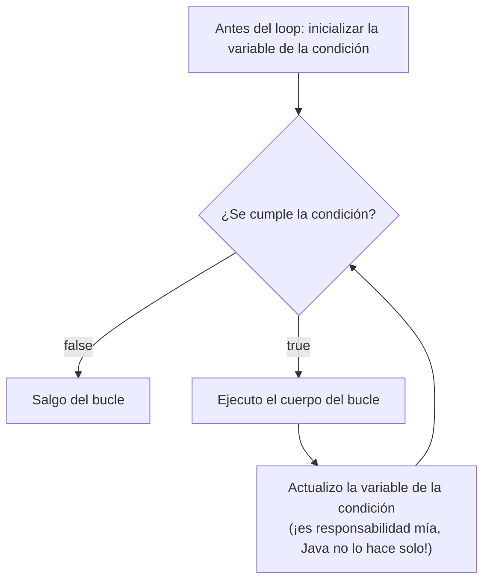
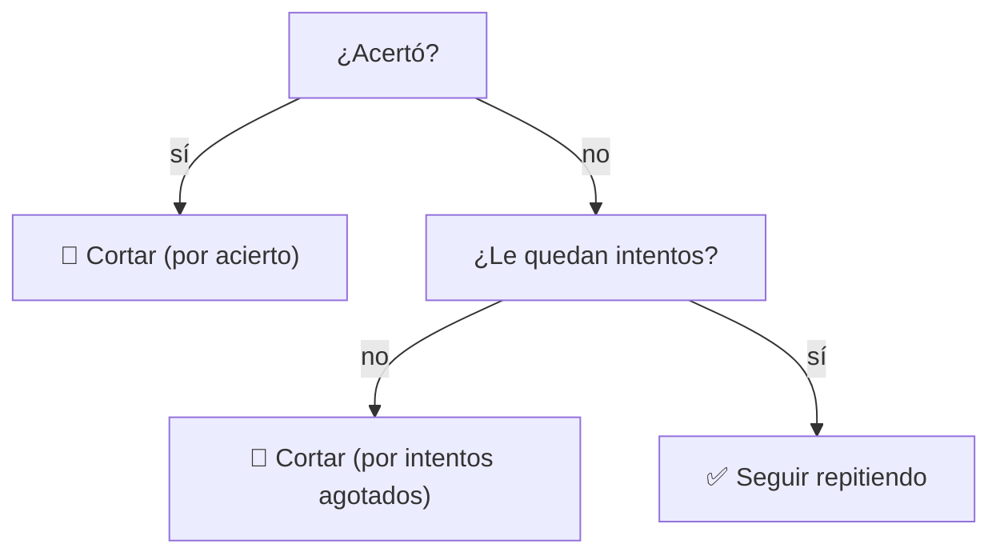
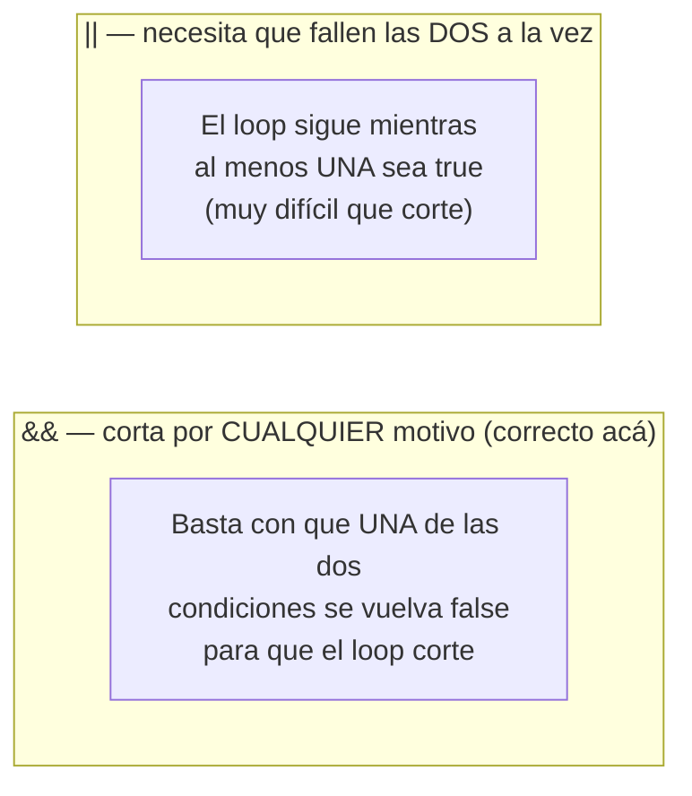

# <span style="color:#1565c0">📘 Apuntes: Ciclo `while`</span>

> [!info] Relacionado
> Código de práctica: [[CODE - EjerciciosCiclowhile]] | [[CODE - Fortalecerwhile]]
> Para repasar el otro tipo de bucle: [[Bucles_apuntes]]

---

## <span style="color:#ef6c00">1. ¿Qué es el `while`, y en qué se diferencia del `for`?</span>

`while` es una estructura de control que repite un bloque de código **mientras** se cumpla una condición. La diferencia clave con `for` no es de sintaxis, es de **cuándo usar cada uno**:

| Usá... | Cuando... |
|---|---|
| `for` | Sabés de antemano **cuántas veces** vas a repetir (recorrer un array de tamaño conocido, contar del 1 al 10) |
| `while` | **No sabés** cuántas veces vas a repetir hasta que el programa lo descubre solo (sumar hasta superar un límite, pedir un dato hasta que sea válido, buscar algo sin saber en qué posición está) |

```java
while (condición) {
    // se repite mientras la condición sea true
    // vos sos responsable de actualizar la variable de la condición acá adentro
}
```

> [!warning] La gran diferencia con `for`
> En el `for`, el incremento (`i++`) es parte obligatoria de la sintaxis — casi nunca te lo olvidás. En el `while`, **no hay ningún lugar fijo** donde Java te obligue a actualizar la variable de corte. Si te la olvidás, la condición nunca cambia y el programa se cuelga en un **bucle infinito**.

---

## <span style="color:#ef6c00">2. Anatomía del `while`</span>



A diferencia del `for`, acá no hay una "casilla" separada para la inicialización ni el incremento — todo vive fuera y dentro de las llaves, a criterio de quien programa.

---

## <span style="color:#ef6c00">3. Antes de usarlo (Requisitos)</span>

- **Operadores relacionales y lógicos** (`<`, `>`, `!=`, `&&`, `||`): son el corazón de la condición del `while`. Ver [[OperadoresLogicos_apuntes]].
- **Arrays** (si vas a recorrer uno con `while`): hay que saber el rango válido de índices. Ver [[Arrayss_apuntes]].

---

## <span style="color:#ef6c00">4. Usar `&&` y `||` en la condición de un `while`</span>

Esto es lo que más se presta a confusión, así que vamos con calma. La clave está en preguntarte: **¿el loop tiene que cortar por UN solo motivo, o por CUALQUIERA de varios motivos posibles?**

### Caso simple: un solo motivo de corte
```java
while (contador <= 10) { ... }
```
Acá no hace falta combinar nada, es una sola condición.

### Caso con dos motivos de corte — el que más confunde

**Ejemplo real:** un validador de PIN que corta cuando **acierta** O cuando **se queda sin intentos** (lo que pase primero).



Fijate que el loop **sigue** solo cuando **ninguna de las dos** condiciones de corte se cumplió todavía. Traducido a la condición del `while` (que describe cuándo **seguir**, no cuándo cortar), hay que **negar ambos motivos de corte y unirlos con `&&`**:

```java
while (noAcerto && quedanIntentos) { ... }
// o, con las variables reales:
while (datoIngresado != pinCorrecto && intentosDisponibles != 0) { ... }
```

> [!tip] Truco mental para no confundirte
> 1. Pensá primero **cuándo tiene que cortar** el loop (en lenguaje humano, con "O" entre los motivos: *"corta si acertó, O si se quedó sin intentos"*).
> 2. Convertí cada motivo de corte a su versión **negada** (*"no acertó"*, *"le quedan intentos"*).
> 3. Uní esas versiones negadas con **`&&`** en la condición del `while`.
>
> Este cambio de "O" (para cortar) a "Y" (para seguir) es la parte que más confunde al principio, pero es la clave del patrón.

### ¿Por qué `||` NO funciona acá?

Con `||`, la condición sería: *"seguí mientras (no acertó) **O** (le quedan intentos)"*. Pensá este caso: el usuario **acierta en el primer intento**, pero todavía le quedan 2 intentos disponibles. La parte "le quedan intentos" sigue siendo `true`, así que **toda la condición sigue siendo `true`** con `||` — ¡el loop seguiría pidiendo el PIN aunque ya haya acertado! Con `||`, para que el loop corte, **ambas** condiciones tienen que fallar **a la vez**, algo que casi nunca coincide en la práctica.



---

## <span style="color:#ef6c00">5. Patrones más comunes con `while`</span>

### Patrón A — Contador simple
```java
int i = 1;
while (i <= 10) {
    System.out.println(i);
    i++;
}
```

### Patrón B — Acumulador con cantidad desconocida de repeticiones
```java
int suma = 0;
int numero = 1;
while (suma <= 50) {
    suma += numero;
    numero++;
}
```
> [!warning] Cuidado con el "término fantasma"
> Si arrancás `numero` en `0` en vez de `1`, la primera vuelta suma `0` — no cambia el resultado numérico de la suma, pero si además estás **contando cuántas veces sumaste**, ese conteo queda inflado en 1 de más. Es un bug que no se nota mirando solo el resultado final, hay que revisar también el conteo.

### Patrón C — Valor centinela (repetir hasta que aparezca una señal de "terminé")
```java
int numero = 0;
int suma = 0;
System.out.println("ingrese un numero (-1 para terminar)");
numero = scanner.nextInt();

while (numero != -1) {
    suma += numero;
    System.out.println("ingrese un numero (-1 para terminar)");
    numero = scanner.nextInt();
}
```
> [!warning] La condición del centinela debe ser una igualdad exacta
> `while (numero > -1)` es distinto a `while (numero != -1)`. Con `>`, cualquier número negativo (por ejemplo `-5`) también cortaría el loop, aunque no sea la señal que se pidió. El centinela tiene que compararse con `!=` contra su valor exacto.

### Patrón D — Búsqueda con corte anticipado (protegiendo el límite del array)
```java
int[] numeros = {4, 8, 15, 16, 23, 42};
boolean encontrado = false;
int i = 0;

while (i < numeros.length && !encontrado) {
    if (numeros[i] == 15) {
        encontrado = true;
    } else {
        i++;
    }
}
```
> [!danger] Nunca busques sin proteger el límite del array
> Si la condición del `while` solo revisa `numeros[i] != 15` sin revisar también `i < numeros.length`, y el valor buscado **no está** en el array, `i` se sigue incrementando hasta salirse del array y el programa explota con `ArrayIndexOutOfBoundsException`. Esta protección con `&&` no es opcional.

### Patrón E — Validar un dato hasta que sea correcto (sin límite de intentos)
```java
int edad = -1;
while (edad < 0 || edad > 120) {
    System.out.println("ingrese una edad válida");
    edad = scanner.nextInt();
}
```
Acá se combina `||` porque el dato es inválido por **cualquiera** de dos motivos (negativo, o demasiado alto) — cualquiera de los dos alcanza para pedirlo de nuevo.

---

## <span style="color:#c62828">⚠️ Errores comunes</span>

> [!danger] Bucle infinito por olvidar actualizar la variable de corte
> ```java
> int i = 1;
> while (i <= 10) {
>     System.out.println(i);
>     // ❌ falta i++; el programa nunca termina
> }
> ```

> [!danger] Condición imposible (dos condiciones contradictorias con &&)
> ```java
> while (monto < saldo && monto > saldo) { ... } // ❌ nunca puede ser true, el loop NUNCA se ejecuta
> ```
> Si necesitás una sola condición de corte, no combines dos que se contradicen entre sí.

> [!danger] No tener un valor para evaluar en la primera vuelta
> A diferencia del `for`, el `while` revisa la condición **antes** de la primera ejecución. Si la variable no tiene todavía un valor "real" (por ejemplo, pedido al usuario), hay que **pedir el primer dato antes del `while`**, o inicializar con un valor que garantice entrar la primera vez a propósito.

> [!danger] Usar `&&` cuando correspondía `||` (o viceversa)
> Repasá la sección 4: si el loop tiene que cortar por **cualquiera** de varios motivos, negá cada motivo y uní con `&&`. Si el dato es inválido por **cualquiera** de varios motivos, uní esas condiciones con `||`.

> [!danger] Buscar en un array sin revisar el límite
> Ver Patrón D — siempre `i < array.length` como parte de la condición cuando el loop recorre un array con índice manual.

---

## <span style="color:#2e7d32">✅ Resumen rápido</span>

- `while`: repetir mientras se cumpla una condición, cuando **no sabés de antemano** cuántas vueltas van a hacer falta.
- Vos sos responsable de actualizar la variable de corte dentro del cuerpo — si no, bucle infinito.
- Dos motivos de corte posibles → negá cada uno y uní con `&&`. Dato inválido por cualquiera de varios motivos → uní con `||`.
- Si el dato viene de afuera (`Scanner`), pedí el primer valor **antes** del `while` para tener algo que evaluar en la primera vuelta.
- Recorrer un array con `while` siempre necesita `i < array.length` en la condición, como protección.
