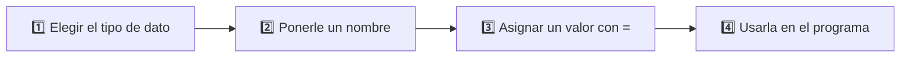
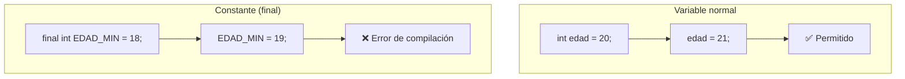

# <span style="color:#1565c0">📘 Apuntes: Variables y Constantes</span>

> [!info] Relacionado
> Código de práctica: [[CODE - variables Y constante]]

---

## <span style="color:#ef6c00">1. ¿Qué es una variable?</span>

Una variable es un espacio en memoria donde guardamos un valor para usarlo más adelante. En Java, primero decimos **qué tipo de dato** tendrá y luego le asignamos un valor — esto se llama **tipado estático**: una vez que declarás el tipo, no podés cambiarlo por otro distinto.



**¿Por qué Java exige declarar el tipo?** Porque así el compilador puede detectar errores *antes* de ejecutar el programa. Si declarás `int edad`, y en algún lado del código intentás guardar `"veinte"` (texto) en esa variable, Java te avisa el error al compilar, sin necesidad de correr el programa para descubrirlo.

---

## <span style="color:#ef6c00">2. Ejercicio 1: variable entera</span>

```java
int entero = 2;
System.out.println(entero);
```

- `int` significa que la variable guardará un número entero.
- En este caso, el valor almacenado es `2`.
- `System.out.println()` permite mostrar el contenido en consola.

> [!tip] Buena práctica
> Usa `int` para números sin decimales. El nombre de la variable debe ser claro y descriptivo (`edad`, no `e` o `x`).

---

## <span style="color:#ef6c00">3. Ejercicio 2: variable decimal</span>

```java
double decimal = 2.5;
System.out.println(decimal);
```

- `double` se usa para guardar números con decimales.
- Aquí se almacena `2.5`.

> [!tip] Buena práctica
> Para decimales, usa `double`. En Java, los decimales se escriben con punto, no con coma.

---

## <span style="color:#ef6c00">4. Ejercicio 3: variable de texto</span>

```java
String cadena = "Hola mundo";
System.out.println(cadena);

cadena = "Hola mundo 2";
System.out.println(cadena);
```

- `String` sirve para guardar texto.
- El texto debe ir entre comillas dobles `"..."`.
- Se puede cambiar el valor de la variable más tarde, como en este ejemplo.

> [!tip] Buena práctica
> `String` almacena cadenas de texto. Si cambiás el valor, la variable sigue existiendo, solo cambia su contenido.

---

## <span style="color:#ef6c00">5. Ejercicio 4: variable con `var`</span>

```java
var variable = "variable con var";
System.out.println(variable);
```

- `var` permite que Java infiera el tipo automáticamente.
- En este caso, Java detecta que la variable es `String`.

> [!warning] Ojo con `var`
> `var` **no** hace que Java sea de tipado dinámico — el tipo se sigue fijando en el momento de la declaración, Java solo lo "adivina" por vos. Una vez asignado, el comportamiento es idéntico a declarar el tipo a mano. Además, `var` solo se puede usar cuando el valor se asigna en la misma línea.

---

## <span style="color:#ef6c00">6. Ejercicio 5: constante</span>

```java
final String CONSTANTE = "Hola mundo 3";
System.out.println(CONSTANTE);
```

- `final` indica que el valor no se puede modificar después de inicializarlo.
- Por eso se le llama constante.
- El nombre está en mayúsculas para diferenciarlo de una variable común.



---

## <span style="color:#c62828">⚠️ Errores comunes</span>

> [!danger] Intentar reasignar una constante
> ```java
> final int MAXIMO = 100;
> MAXIMO = 200; // ❌ Error: cannot assign a value to final variable 'MAXIMO'
> ```
> Una vez que un `final` tiene su primer valor, esa asignación es para siempre.

> [!danger] Usar una variable sin inicializar
> ```java
> int contador;
> System.out.println(contador); // ❌ Error: variable contador might not have been initialized
> ```
> A diferencia de otros lenguajes, Java no te deja usar una variable local sin haberle dado un valor antes.

> [!danger] Mezclar tipos incompatibles
> ```java
> int numero = "5"; // ❌ Error: incompatible types: String cannot be converted to int
> ```
> Para pasar de `String` a `int` hace falta una conversión explícita (ver [[ConversionDeDatos_apuntes]]).

---

## <span style="color:#2e7d32">✅ Resumen rápido</span>

| Palabra clave | Uso |
|---|---|
| `int` | números enteros |
| `double` | números decimales |
| `String` | texto |
| `var` | Java deduce el tipo (solo si se asigna en la misma línea) |
| `final` | valor fijo que no cambia una vez asignado |
